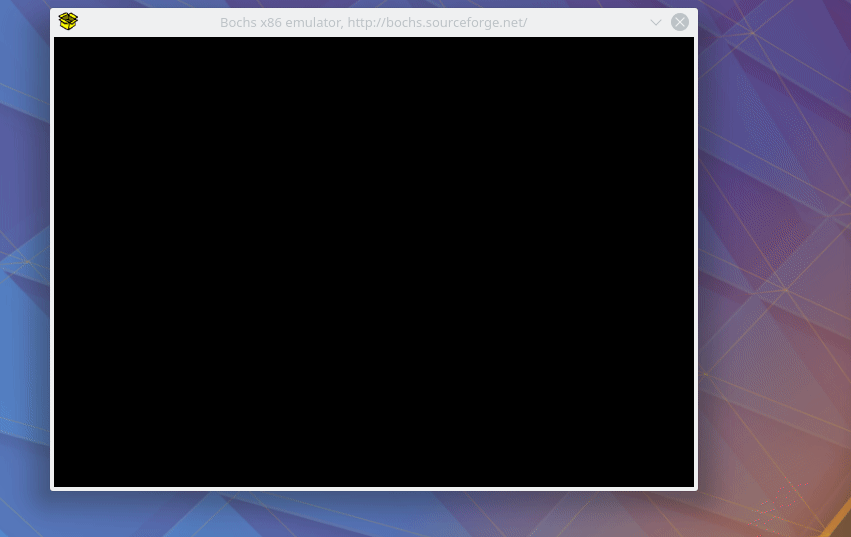

## Objectives

**Modify `linux-0.11/boot/bootsect.s` to print a specific string instead of "Loading System..." at boot time.**

 

**Rewrite `linux-0.11/boot/setup.s` to output "Now we are in SETUP" when the execution enters `setup.s`.**

 

**Modify the `linux-0.11/boot/setup.s` you just wrote to get a hardware status and output the result.**

 

**Modify the `linux-0.11/tools/build.c` to generate a boot-only image by excuting `make BootImage` under the `linux-0.11` directory.**

## Demo

