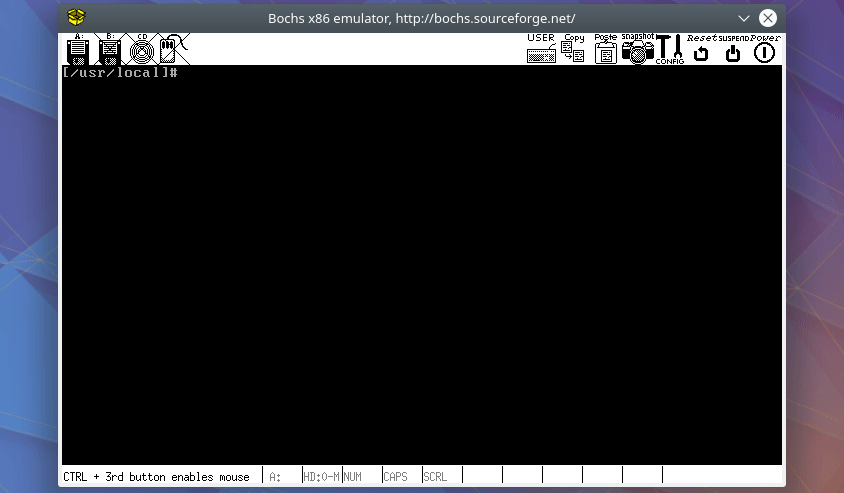

## Objectives

**Add two system calls on Linux 0.11:**

```c
/*
Copy the name string to the kernel, and the name must be no longer than 23 characters.

On success, the number of characters copied is returned.

If the length of name exceeds 23, return "-1" and set errno to EINVAL.
*/

int iam(const char * name);

/*
Copy the string saved by iam() to the user space pointed to by parameter name,
and the size of the user space is specified by parameter size. 

On success, the number of characters copied is returned.

If parameter size is less than the length of string, return "-1" and set errno to EINVAL.
*/

int whoami(char* name, unsigned int size);
```


You may implement these two system calls in `linux-0.11/kernel/who.c`, and the statement should be `int sys_iam(const char * name)` and `int sys_whoami(char* name, unsigned int size)` .


You also need to modify `linux-0.11/kernel/system_call.s`, `linux-0.11/include/unistd.h`,  `linux-0.11/include/linux/sys.h`, , `linux-0.11/kernel/Makefile` and `/usr/include/unistd.h`.

<br />

**After adding these two system calls, you need to write two simple programs `iam.c` and `whoami.c` to use them. The interaction should be like:**

```shell
[/usr/local]# ./iam lizhijun
[/usr/local]# whoami
lizhijun
[/usr/local]# 
```

<br />

**`testlab2.c` and `testlab2.sh` are the test programs for this lab, relying on the `iam` and `whoami` you just wrote. The full marks for these two test programs are 50% and 30% respectively.**


## Demo


