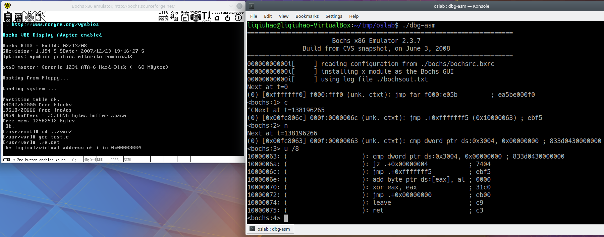
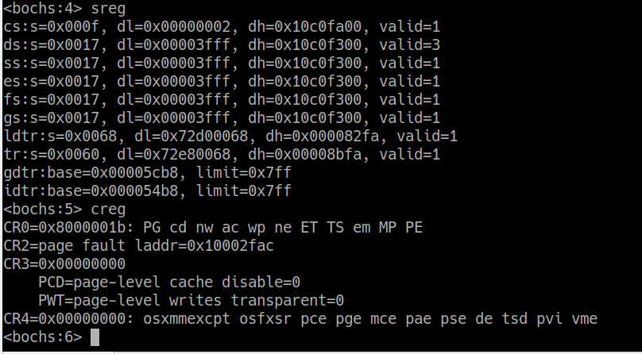
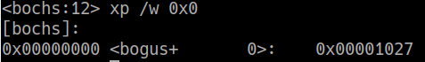
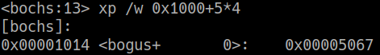
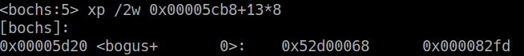
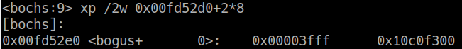
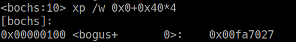
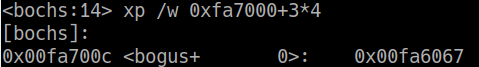
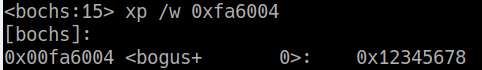
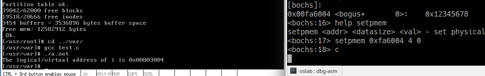

# Segment and Page Translation

~~~c
/* test.c */
#include <stdio.h>

int i = 0x12345678;

int main(void)
{
    printf("The logical/virtual address of i is 0x%08x\n", &i);
    fflush(stdout);
    while (i);
    return 0;
}

~~~

 

**Hang the program in user mode:**

  

**Value of LDTR (selector of LDT), GDTR (linear address of GDT) and CR3 {physical address of the first (only one in linux 0.11) page directory entry} :**

  

> The following explanatory images of the intel 80386 architecture were copied from [ 6.828: Operating System Engineering ]( https://pdos.csail.mit.edu/6.828/2014/readings/i386/c05.htm ).

  

**Page address translation analysis (GDT) :**

GDT_linear_base_address = 0x00005cb8 = 0b0-101-110010111000

DIR = 0x0, PAGE = 0x5, offset = 0xCB8

  

DIR = 0x0, find the physical address of page table:

0b1-000000100111, page_table_physical_address = 0x1000

  

PAGE = 0x5, find the physical page address of GDT:

0b101-000001100111, GDT_page_physical_address = 0x5000

  

GDT_physical_base_address  = 0x5000 + 0xCB8 = 0x5CB8 = GDT_linear_base_address 

  

**Segment address translation analysis (LDT) :**

LDTR selector: 0b0000000001101-0-00, index = 0b1101 = 13

  

Find the descriptor of current LDT:

LDT_linear_base_address = 0x00fd52d0 = 0b11-1111010101-001011010000

DIR = 0x3, PAGE = 0x3D5, offset = 0x2D0

 

As mentioned above, through page address translation, we can get the physical address of LDT:

LDT_physical_address = 0x00fd52d0 = LDT_linear_base_address

 

*In fact, in Linux 0.11, the linear address on 0-16MB is the same as its physical address.*

 

**Find the physical address of variable i:**

ds: 0x0017 = 0b00010-1-11, selector index = 2

i_linear_address = 0x10000000 + 0x3004 = 0x10003004= , 0b1000000-0000000011-000000000100

DIR = 0x40, PAGE = 0x3, offset = 0x4

 

DIR = 0x40, find the physical address of page table:

page_table_physical_address = 0xfa7000, PAGE = 0x3, find the physical page address of i:

i_physical_address = 0xfa6000 + 0x4 = 0xfa6004:

 

**Verification (break the loop) :**

